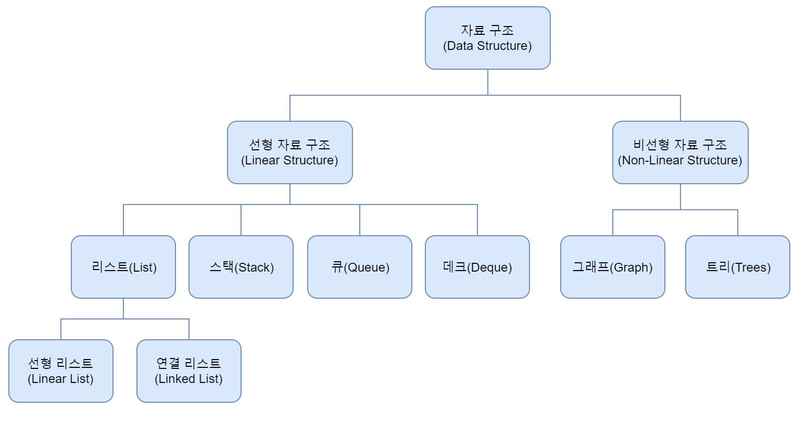

# Algorithm-Class
알고리즘 자료구조 강의 자료입니다.

## 왜 알아야 할까?
알고리즘은 프로그램의 설계도로, 프로그램의 결과는 이 설계도를 바탕으로 지어진 건물에 비유할 수 있습니다. 알고리즘은 수학적 개념에 가깝고, 프로그래밍은 이를 구현하는 과정입니다. 이 둘은 서로에게 필수적이며, 알고리즘에 따라 프로그램의 속도나 처리 방식이 달라질 수 있습니다. 따라서, 알고리즘을 이해하고 선택하는 것이 중요합니다.

## 시간 복잡도
알고리즘의 성능을 평가하는 척도로, 시간 복잡도와 공간 복잡도가 있습니다. 시간 복잡도는 알고리즘의 수행 시간을 평가하는 척도로, 입력 크기에 따라 수행 시간이 어떻게 증가하는지를 나타냅니다. 시간 복잡도는 빅오 표기법으로 표현하며, 최악의 경우를 나타냅니다.
## 시간 복잡도 표기

알고리즘의 시간 복잡도는 입력 크기에 따라 알고리즘의 수행 시간이 어떻게 증가하는지를 나타냅니다. 아래는 일반적인 시간 복잡도 표기와 그 의미를 정리한 표입니다.

| 표기법               | 명칭                | 설명                                  |
|-------------------|---------------------|-------------------------------------|
| \( O(1) \)        | 상수 시간           | 입력 크기에 상관없이 항상 일정한 시간이 소요됩니다.       |
| \( O(\log n) \)   | 로그 시간         | 입력 크기가 커질수록 수행 시간이 로그 함수 형태로 증가합니다. |
| \( O(n) \)        | 선형 시간           | 입력 크기에 비례하여 수행 시간이 증가합니다.           |
| \( O(n \log n) \) | 로그 선형 시간 | 입력 크기와 로그 함수의 곱 형태로 수행 시간이 증가합니다.  |
| \( O(n^2) \)      | 이차 시간           | 입력 크기의 제곱에 비례하여 수행 시간이 증가합니다.       |
| \( O(2^n) \)      | 지수 시간           | 입력 크기에 따라 수행 시간이 지수 함수 형태로 증가합니다.   |
| \( O(n!) \)       | 팩토리얼 시간       | 입력 크기에 따라 수행 시간이 팩토리얼 함수 형태로 증가합니다. |

이 표는 알고리즘의 효율성을 평가할 때 유용하게 사용됩니다. 시간 복잡도가 낮을수록 알고리즘이 더 효율적입니다.

## 공간 복잡도
공간 복잡도는 알고리즘의 메모리 사용량을 평가하는 척도로, 입력 크기에 따라 알고리즘의 메모리 사용량이 어떻게 증가하는지를 나타냅니다. 공간 복잡도는 빅오 표기법으로 표현하며, 최악의 경우를 나타냅니다.

## 자료구조
자료구조는 데이터를 효율적으로 저장하고 관리하는 방법을 의미합니다. 데이터를 저장하는 방식에 따라 성능이 달라지며, 알고리즘의 성능을 높이기 위해 자료구조를 잘 선택하는 것이 중요합니다. 자료구조에는 배열, 연결 리스트, 스택, 큐, 트리, 그래프 등이 있으며, 각각의 특징과 사용법을 알고 있어야 합니다.
> ### 선형 자료구조
> 선형 자료구조는 데이터를 일렬로 저장하는 방식으로, 데이터를 순차적으로 접근할 수 있습니다. 대표적인 선형 자료구조로는 배열, 연결 리스트, 스택, 큐 등이 있습니다.
> ### 선형 자료구조 종류
> #### 1. 배열 (Array)
>- **정의**: 배열은 동일한 타입의 데이터를 연속된 메모리 공간에 저장하는 자료구조입니다.
>- **특징**:
>    - 인덱스를 통해 각 요소에 직접 접근 가능 (시간복잡도 O(1))
>    - 크기가 고정되어 있어 미리 크기를 설정해야 함
>    - 삽입, 삭제가 비효율적 (평균적으로 O(n))
>
> #### 2. 연결 리스트 (Linked List)
>- **정의**: 연결 리스트는 각 요소가 노드로 이루어져 있으며, 각 노드는 데이터와 다음 노드를 가리키는 포인터를 포함하는 자료구조입니다.
>- **특징**:
>    - 동적 메모리 할당으로 크기 제한이 없음
>    - 삽입, 삭제가 배열보다 효율적 (시간복잡도 O(1) ~ O(n))
>    - 인덱스 접근이 불가능하며 순차 탐색만 가능 (시간복잡도 O(n))
>
> #### 3. 스택 (Stack)
>- **정의**: 스택은 후입선출(LIFO, Last In First Out) 방식으로 작동하는 자료구조입니다.
>- **특징**:
>    - 데이터 삽입과 삭제가 한쪽 끝에서만 이루어짐
>    - 삽입(푸시)와 삭제(팝)의 시간복잡도는 O(1)
>    - 주로 함수 호출 관리, 역순 작업 등에 사용됨
>
> #### 4. 큐 (Queue)
>- **정의**: 큐는 선입선출(FIFO, First In First Out) 방식으로 작동하는 자료구조입니다.
>- **특징**:
>    - 데이터 삽입은 뒤쪽(후단), 삭제는 앞쪽(전단)에서 이루어짐
>    - 삽입(인큐)와 삭제(디큐)의 시간복잡도는 O(1)
>    - 주로 작업 대기열, 버퍼 관리 등에 사용됨
> #### 5. 덱 (Deque)
> - **정의**: 덱은 양쪽 끝에서 삽입과 삭제가 모두 가능한 자료구조입니다.
> - **특징**:
>    - 큐와 스택을 합친 형태로, 양쪽 끝에서 삽입과 삭제가 가능
>    - 삽입과 삭제의 시간복잡도는 O(1)
>    - 주로 스크롤, 양방향 탐색 등에 사용됨
>    - 큐와 스택의 장점을 모두 가지고 있어 다양한 상황에 활용 가능
>  #### 6. 우선순위 큐 (Priority Queue)
> - **정의**: 우선순위 큐는 각 요소에 우선순위를 부여하여 가장 높은 우선순위의 요소가 먼저 삭제되는 자료구조입니다.
> - **특징**:
> - 삽입과 삭제의 시간복잡도는 O(log n)
> - 주로 최대값, 최소값을 빠르게 찾아야 하는 상황에 사용됨
> - 힙(Heap) 자료구조를 사용하여 구현됨
> - 우선순위에 따라 정렬된 상태로 유지되어야 함
> - 우선순위 큐는 배열, 연결 리스트, 힙 등으로 구현될 수 있음
> - 우선순위 큐는 힙(Heap) 자료구조를 사용하여 구현됩니다.
> - 힙은 완전 이진 트리로, 부모 노드의 값이 자식 노드의 값보다 크거나 작은 조건을 만족합니다.
> - 힙은 최대 힙과 최소 힙으로 나뉘며, 최대 힙은 부모 노드의 값이 자식 노드의 값보다 크거나 같고, 최소 힙은 부모 노드의 값이 자식 노드의 값보다 작거나 같습니다.
> ### 비선형 자료구조
> 비선형 자료구조는 데이터를 계층적으로 저장하는 방식으로, 데이터를 순차적으로 접근할 수 없습니다. 대표적인 비선형 자료구조로는 트리, 그래프 등이 있습니다.

# 자료구조 이미지

